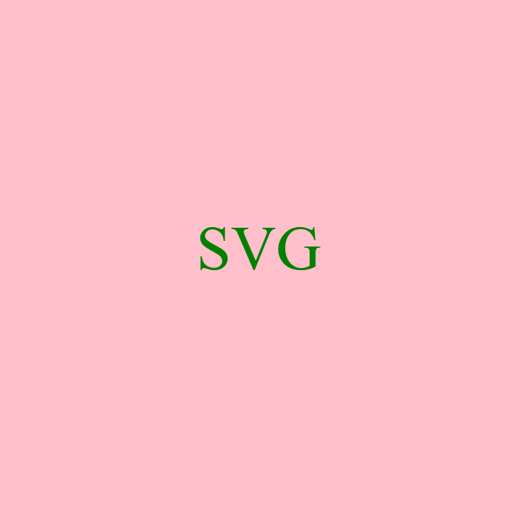

# <Logo-Generator>>

## Description

Provide a short description explaining the what, why, and how of your project. Use the following questions as a guide:

- What was your motivation?

My motivation was to test my skills with something I believe i understand fairly decently. Through working on this project I was able to realize my position on where my knowledge sits on this subject and what i can do with this knowledge and what i can create.

- Why did you build this project? (Note: the answer is not "Because it was a homework assignment.")

I built this project to further my knowledge on using the built in terminal. The README generator helped my knowledge in this area although this project had even furthered this knowledge to really show the use of these features.

- What problem does it solve?

This solves the problem of someone who doesnt know how to make a logo, although the project is extremely simple it can still take a basic shape and text to make a mock logo, possibly to use for development stages.

- What did you learn?

I learned how to create tests for the code i write and the usefullness of this feature in the real world. I also learned on how to use different dependencies within the project im working on, in this case it would be generating a logo based on user inputs.

## Table of Contents (Optional)

If your README is long, add a table of contents to make it easy for users to find what they need.

- [Installation](#installation)
- [Usage](#usage)
- [Credits](#credits)
- [License](#license)

## Installation

What are the steps required to install your project? Provide a step-by-step description of how to get the development environment running.

N/A

## Usage

Provide instructions and examples for use. Include screenshots as needed.

To add a screenshot, create an `assets/images` folder in your repository and upload your screenshot to it. Then, using the relative filepath, add it to your README using the following syntax:

Video: https://drive.google.com/file/d/1OSz6fHG7NWCTiRYYdJWdalU4NssUDmJc/view?usp=sharing

## Credits

List your collaborators, if any, with links to their GitHub profiles.

If you used any third-party assets that require attribution, list the creators with links to their primary web presence in this section.

If you followed tutorials, include links to those here as well.

N/A

## License

The last section of a high-quality README file is the license. This lets other developers know what they can and cannot do with your project. If you need help choosing a license, refer to [https://choosealicense.com/](https://choosealicense.com/).

---

🏆 The previous sections are the bare minimum, and your project will ultimately determine the content of this document. You might also want to consider adding the following sections.

N/A

## Badges

Badges aren't necessary, per se, but they demonstrate street cred. Badges let other developers know that you know what you're doing. Check out the badges hosted by [shields.io](https://shields.io/). You may not understand what they all represent now, but you will in time.

N/A

## Features

If your project has a lot of features, list them here.

N/A

## How to Contribute

If you created an application or package and would like other developers to contribute it, you can include guidelines for how to do so. The [Contributor Covenant](https://www.contributor-covenant.org/) is an industry standard, but you can always write your own if you'd prefer.

N/A

## Tests

Go the extra mile and write tests for your application. Then provide examples on how to run them here.

N/A